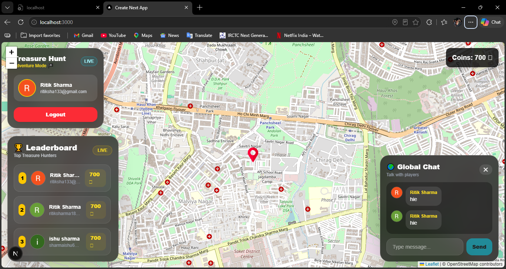
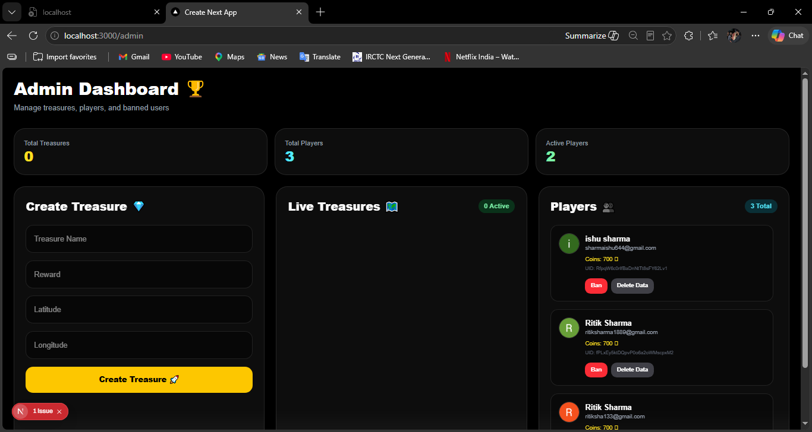

# 🏴‍☠️ Treasure Hunt Game

A realtime multiplayer-style Treasure Hunt game built using:

- Next.js 15
- TypeScript
- Firebase
- Firestore
- Google Authentication
- React Leaflet
- Geolocation API

---

# ✨ Features

✅ Google Login Authentication  
✅ Live GPS Tracking  
✅ Realtime Treasure Updates  
✅ Admin Dashboard  
✅ Firestore Database  
✅ Coin Reward System  
✅ Treasure Collection  
✅ Persistent Player Data  
✅ Realtime Multiplayer Feel  
✅ Route Navigation  
✅ Responsive UI

---

# 📸 Screenshots

### 🗺️ Player Dashboard



---

### 🔐 Admin Dashboard



# 🚀 Live Demo

https://treasure-hunt-game-fv8k.vercel.app/

---

# ⚙️ Installation

## 1. Clone Repository

```bash
git clone https://github.com/YOUR_USERNAME/treasure-hunt-game.git
```

---

## 2. Open Project

```bash
cd treasure-hunt-game
```

---

## 3. Install Dependencies

```bash
npm install
```

---

## 4. Create Environment File

Create:

```txt
.env.local
```

Add:

```env
NEXT_PUBLIC_FIREBASE_API_KEY=
NEXT_PUBLIC_FIREBASE_AUTH_DOMAIN=
NEXT_PUBLIC_FIREBASE_PROJECT_ID=
NEXT_PUBLIC_FIREBASE_STORAGE_BUCKET=
NEXT_PUBLIC_FIREBASE_MESSAGING_SENDER_ID=
NEXT_PUBLIC_FIREBASE_APP_ID=
NEXT_PUBLIC_FIREBASE_MEASUREMENT_ID=
```

---

## 5. Run Project

```bash
npm run dev
```

---

# 🔥 Firebase Setup

## Enable:

- Google Authentication
- Firestore Database

---

## Firestore Collections

### users

Stores:
- coins
- collected treasures
- player data

### treasures

Stores:
- treasure name
- reward
- latitude
- longitude

### admins

Stores admin access.

Document ID must equal Firebase Auth UID.

---

# 🔐 Firestore Rules

```js
rules_version = '2';

service cloud.firestore {

  match /databases/{database}/documents {

    match /users/{userId} {

      allow read, write:
      if request.auth != null
      && request.auth.uid == userId;

    }

    match /admins/{userId} {

      allow read:
      if request.auth != null
      && request.auth.uid == userId;

      allow write: if false;

    }

    match /treasures/{treasureId} {

      allow read: if true;

      allow create, update, delete:
      if request.auth != null
      && exists(
        /databases/$(database)/documents/admins/$(request.auth.uid)
      );

    }

  }

}
```

---

# 🗺️ Admin Panel

Open:

```txt
/admin
```

Only admins can create treasures.

---

# 🛠️ Tech Stack

- Next.js
- React
- TypeScript
- Firebase
- Firestore
- React Leaflet
- Tailwind CSS
- Geolib

---

# 📦 Future Improvements

- Leaderboard
- Multiplayer Players
- Treasure Animations
- Sound Effects
- Daily Rewards
- Treasure Radar
- PWA Mobile App

---

# 👨‍💻 Author

Ritik Sharma